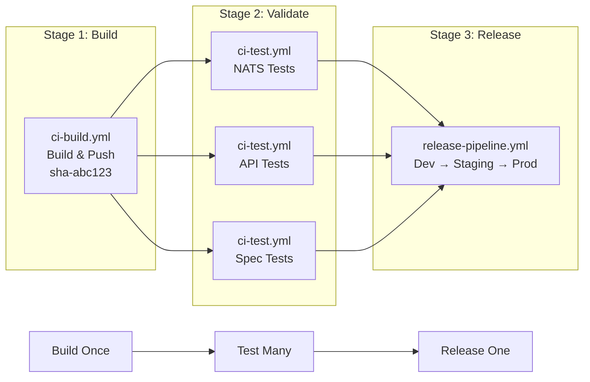

# Platform Reusable Workflows

This directory contains the **"Build Once, Validate Many, Release One"** pattern implementation using GitHub Actions reusable workflows.

## Architecture Overview

### The Problem Solved
- **Inefficient**: Each test building its own image
- **Inconsistent**: Different builds for testing vs deployment  
- **Hard to Debug**: Monolithic workflows hide specific test failures
- **Artifact Drift**: What you test ≠ what you deploy

### The Solution: 3-Stage Flow



## Platform Reusable Workflows

### 1. `ci-build.yml` - Build Once
**Purpose**: Build Docker image once, push with `sha-<commit>` tag, output tag for downstream jobs

**Inputs**:
- `service_name` (optional) - Defaults to repository name

**Outputs**:
- `image_tag` - Built image tag (e.g., `ghcr.io/org/service:sha-abc123`)

**Usage**:
```yaml
build:
  uses: arun4infra/zerotouch-platform/.github/workflows/ci-build.yml@main
  secrets:
    BOT_GITHUB_TOKEN: ${{ secrets.BOT_GITHUB_TOKEN }}
```

### 2. `ci-test.yml` - Validate Many
**Purpose**: Accept image tag, spin up Kind, run specific test suite

**Inputs**:
- `image_tag` (required) - Container image to test
- `test_suite` (required) - Test path (e.g., `tests/integration/nats`)
- `test_name` (optional) - Test identifier
- `timeout` (optional) - Timeout in minutes (default: 30)
- `use_real_llm` (optional) - Use real LLM APIs (default: false)

**Usage**:
```yaml
test-nats:
  needs: build
  uses: arun4infra/zerotouch-platform/.github/workflows/ci-test.yml@main
  with:
    image_tag: ${{ needs.build.outputs.image_tag }}
    test_suite: "tests/integration/nats"
    test_name: "nats-events"
```

### 3. `release-pipeline.yml` - Release One
**Purpose**: Deploy validated image through Dev → Staging → Production with GitHub Environment gates

**Inputs**:
- `image_tag` (required) - Validated image to deploy
- `service_name` (optional) - Service name
- `tenant_repo_url` (optional) - Tenant repository URL

**Usage**:
```yaml
release:
  needs: [build, test-nats, test-api]
  if: github.ref == 'refs/heads/main'
  uses: arun4infra/zerotouch-platform/.github/workflows/release-pipeline.yml@main
  with:
    image_tag: ${{ needs.build.outputs.image_tag }}
```

## Service Implementation Pattern

Services create a **single orchestration workflow** that wires together the platform workflows:

### File: `.github/workflows/main-pipeline.yml`

```yaml
name: Main Pipeline

on:
  push:
    branches: [ "main" ]
  pull_request:
    branches: [ "main" ]

jobs:
  # STAGE 1: BUILD - Creates artifact once
  build:
    uses: arun4infra/zerotouch-platform/.github/workflows/ci-build.yml@main
    secrets:
      BOT_GITHUB_TOKEN: ${{ secrets.BOT_GITHUB_TOKEN }}

  # STAGE 2: VALIDATION - Parallel tests using same artifact
  test-nats:
    needs: build
    uses: arun4infra/zerotouch-platform/.github/workflows/ci-test.yml@main
    with:
      image_tag: ${{ needs.build.outputs.image_tag }}
      test_suite: "tests/integration/nats"

  test-api:
    needs: build
    uses: arun4infra/zerotouch-platform/.github/workflows/ci-test.yml@main
    with:
      image_tag: ${{ needs.build.outputs.image_tag }}
      test_suite: "tests/integration/api"

  # STAGE 3: RELEASE - Only if all tests pass
  release:
    needs: [build, test-nats, test-api]
    if: github.ref == 'refs/heads/main'
    uses: arun4infra/zerotouch-platform/.github/workflows/release-pipeline.yml@main
    with:
      image_tag: ${{ needs.build.outputs.image_tag }}
```

## Key Benefits

### ✅ **Build Efficiency**
- **1 build** instead of N builds (where N = number of test suites)
- **Faster CI**: Parallel tests using pre-built image
- **Consistent artifacts**: Same image tested and deployed

### ✅ **Test Visibility** 
- **Granular failures**: Each test suite shows as separate job
- **Parallel execution**: Tests run simultaneously
- **Easy debugging**: Focused logs per test type

### ✅ **Deployment Safety**
- **Artifact guarantee**: Exact tested image deployed
- **Gate enforcement**: All tests must pass before release
- **Audit trail**: Clear progression from build → test → deploy

### ✅ **Platform Benefits**
- **Reusable**: Same workflows across all services
- **Maintainable**: Platform improvements benefit all services
- **Standardized**: Consistent CI/CD patterns

## Migration Guide

### From Old Pattern:
```yaml
# Multiple workflows, each building separately
nats-tests.yml    # Builds image, runs NATS tests
api-tests.yml     # Builds image, runs API tests  
release.yml       # Builds image, deploys
```

### To New Pattern:
```yaml
# Single orchestration workflow
main-pipeline.yml # Build once → Test many → Release one
```

### Steps:
1. **Copy template**: Use `scripts/release/template/example-tenant-workflow.yml`
2. **Customize tests**: Add your specific test suites
3. **Archive old workflows**: Move to `archived/` directory
4. **Test the flow**: Verify build → test → release progression

## Troubleshooting

### Common Issues:

**Q: Tests fail with "image not found"**
- **A**: Check `image_tag` is correctly passed from build job to test jobs

**Q: Release runs even when tests fail**  
- **A**: Ensure `needs: [build, test1, test2]` includes ALL test jobs

**Q: Different test results between local and CI**
- **A**: Tests now use the exact built image, ensuring consistency

**Q: How to add a new test suite?**
- **A**: Add another `test-*` job in the service's `main-pipeline.yml`

This architecture provides the **Golden Path** for modern CI/CD: efficient, visible, and safe.