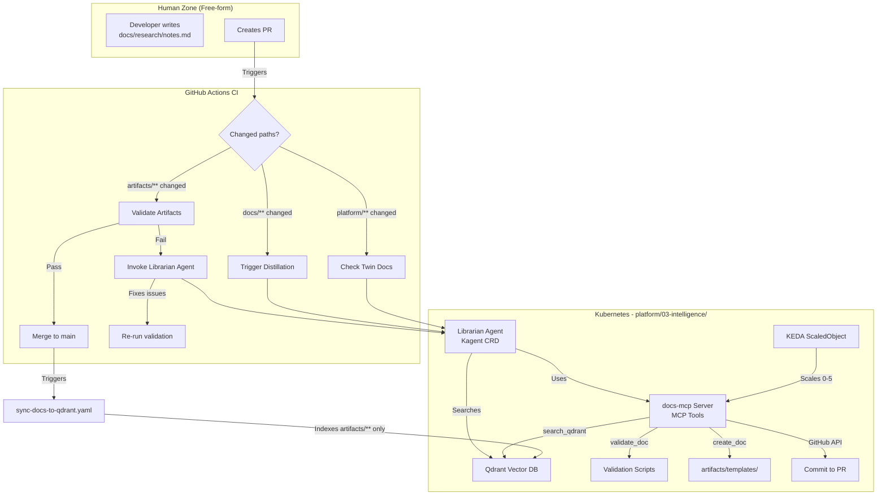

# Design Document: Intelligence Layer - Documentation Automation

## Overview

This design document outlines the technical approach for building the Documentation Automation System within the Intelligence Layer. The system uses **Kagent** (Kubernetes-native AI agent framework) to automatically maintain structured documentation in `artifacts/` while preserving human freedom in `docs/`.

**Key Design Principles:**
- **Two-zone architecture**: `docs/` (human, free-form) vs. `artifacts/` (agent, strict format)
- **Qdrant indexes only `artifacts/`**: Agent knowledge base is strictly curated
- **CI auto-fix**: Validation failures trigger agent to fix issues autonomously
- **Distillation workflow**: Agent extracts

 useful info from `docs/` PRs → creates structured `artifacts/` content
- **KEDA autoscaling**: docs-mcp server scales 0→5 based on load

---

## Architecture

### High-Level Flow



---

## Two-Zone Architecture

### Zone Comparison

| Aspect | `docs/` (Human Zone) | `artifacts/` (Agent Zone) |
|:-------|:--------------------|:-------------------------|
| **Owner** | Developers, operators | Librarian Agent |
| **Format** | Free-form (markdown, notes, whatever) | Strict (ADR 003: tables/lists only) |
| **Validation** | None | Schema, prose detection, filename rules |
| **Qdrant Indexed** | ❌ No | ✅ Yes |
| **CODEOWNERS** | Open (anyone can commit) | Restricted (agent only) |
| **Examples** | Meeting notes, research, drafts | Twin Docs, runbooks, structured ADRs |

### Directory Structure

```
infra-platform/
├── artifacts/               # AGENT-ONLY ZONE
│   ├── templates/
│   │   ├── runbook-template.md
│   │   ├── spec-template.md
│   │   └── adr-template.md
│   ├── scripts/             # Validation scripts (moved by agent during AC testing)
│   │   ├── validate_doc_schemas.py
│   │   ├── detect_prose.py
│   │   └── validate_filenames.py
│   ├── specs/               # Twin Docs (1:1 with platform resources)
│   │   ├── webservice.md
│   │   ├── postgresql.md
│   │   └── dragonfly.md
│   ├── runbooks/            # Operational guides (structured)
│   │   └── postgres/
│   │       ├── volume-full.md
│   │       └── backup-restore.md
│   └── architecture/        # Structured ADRs (if needed)
│
├── docs/                    # HUMAN-ONLY ZONE (free-form, no rules)
│   ├── templates/           # Human templates (will be moved by agent)
│   ├── architecture/        # Current ADRs (will be moved by agent)
│   ├── research/
│   ├── meeting-notes/
│   └── troubleshooting/
│
├── platform/                # Platform manifests
│   ├── 03-intelligence/
│   │   ├── qdrant.yaml
│   │   ├── docs-mcp-server.yaml
│   │   └── librarian-agent.yaml
│   └── 04-apis/
│       └── compositions/
│           └── webservice.yaml  → triggers artifacts/specs/webservice.md
│
├── scripts/                 # Will be moved to artifacts/scripts/ by agent
└── CODEOWNERS
```

---

## Component Specifications

### 1. Qdrant Vector Database

**Purpose:** Semantic search index for agent-maintained documentation

**Deployment:**
```yaml
# platform/03-intelligence/qdrant.yaml
apiVersion: apps/v1
kind: StatefulSet
metadata:
  name: qdrant
  namespace: intelligence
spec:
  serviceName: qdrant
  replicas: 1
  selector:
    matchLabels:
      app: qdrant
  template:
    metadata:
      labels:
        app: qdrant
    spec:
      containers:
      - name: qdrant
        image: qdrant/qdrant:v1.7.4
        ports:
        - containerPort: 6333
          name: http
        - containerPort: 6334
          name: grpc
        env:
        - name: QDRANT__SERVICE__HTTP_PORT
          value: "6333"
        - name: QDRANT__SERVICE__GRPC_PORT
          value: "6334"
        volumeMounts:
        - name: qdrant-storage
          mountPath: /qdrant/storage
        resources:
          requests:
            memory: "512Mi"
            cpu: "250m"
          limits:
            memory: "2Gi"
            cpu: "1000m"
  volumeClaimTemplates:
  - metadata:
      name: qdrant-storage
    spec:
      accessModes: ["ReadWriteOnce"]
      resources:
        requests:
          storage: 10Gi
```

**Schema (Collection: `platform-docs`):**
```json
{
  "id": "artifacts-specs-webservice-001",
  "vector": [0.1, 0.2, ...],
  "payload": {
    "file_path": "artifacts/specs/webservice.md",
    "title": "WebService API Specification",
    "category": "spec",
    "resource": "webservice",
    "last_indexed_commit": "abc123def",
    "last_indexed_at": "2025-11-23T10:00:00Z",
    "section_title": "Configuration Parameters"
  }
}
```

**Indexing Logic:**
- Index only `artifacts/**/*.md`
- Chunk size: 512 tokens, 50% overlap
- Embeddings: OpenAI `text-embedding-3-small` or similar
- Metadata includes: file path, title, category, resource name, commit hash

---

### 2. docs-mcp Server

**Purpose:** MCP tool server providing documentation operations to Librarian Agent

**MCP Tools:**

| Tool Name | Function Signature | Purpose |
|:----------|:------------------|:--------|
| `validate_doc` | `validate_doc(file_path: str) -> ValidationResult` | Run schema/prose/filename validation |
| `create_doc` | `create_doc(category: str, resource: str, metadata: dict, content: dict) -> FilePath` | Create from template, validate, return path |
| `update_doc` | `update_doc(file_path: str, section: str, new_content: str) -> bool` | Update specific table/section |
| `search_qdrant` | `search_qdrant(query: str, category: str, limit: int) -> List[SearchResult]` | Semantic search, return [{file_path, score}] |
| `fetch_from_git` | `fetch_from_git(file_path: str, branch: str) -> FileContent` | GitHub API get file content |
| `commit_to_pr` | `commit_to_pr(pr_number: int, files: List[FileChange], message: str) -> CommitSHA` | Commit changes to PR branch |
| `sync_to_qdrant` | `sync_to_qdrant(docs_path: str, commit_sha: str) -> IndexStats` | Chunk, embed, index artifacts/ |

**Deployment with KEDA:**
```yaml
# platform/03-intelligence/docs-mcp-server.yaml
apiVersion: keda.sh/v1alpha1
kind: ScaledObject
metadata:
  name: docs-mcp-scaler
  namespace: intelligence
spec:
  scaleTargetRef:
    name: docs-mcp
  minReplicaCount: 0  # Scale to zero when idle
  maxReplicaCount: 5
  triggers:
  - type: prometheus
    metadata:
      serverAddress: http://prometheus.observability.svc.cluster.local:9090
      metricName: http_requests_total
      query: sum(rate(http_requests_total{service="docs-mcp",namespace="intelligence"}[1m]))
      threshold: "10"
  - type: cpu
    metadataSpec:
      type: Utilization
      value: "70"
```

**GitHub API Integration:**
```python
# services/docs-mcp/tools/git.py
class GitHubAPI:
    def __init__(self, token: str, repo: str):
        self.token = token
        self.repo = repo  # e.g., "bizmatters/infra-platform"
    
    def fetch_file(self, path: str, branch: str = "main") -> str:
        url = f"https://api.github.com/repos/{self.repo}/contents/{path}?ref={branch}"
        response = requests.get(url, headers={"Authorization": f"token {self.token}"})
        content_b64 = response.json()["content"]
        return base64.b64decode(content_b64).decode('utf-8')
    
    def commit_files(self, pr_number: int, files: List[FileChange], message: str) -> str:
        # Get PR branch
        branch = self.get_pr_branch(pr_number)
        
        # For each file, create/update via GitHub API
        for file in files:
            self.create_or_update_file(
                path=file.path,
                content=file.content,
                message=message,
                branch=branch
            )
        
        return self.get_latest_commit_sha(branch)
```

---

### 3. Librarian Agent

**Purpose:** Kagent agent orchestrating documentation maintenance

**System Prompt (Embedded Standards):**

The system prompt includes:
1. **No-Fluff Policy** (tables/lists only, no prose)
2. **File naming rules** (kebab-case, max 3 words)
3. **Create vs. Update decision logic** (specs: check existence, runbooks: Qdrant similarity > 0.85)
4. **Template adherence** (always use `artifacts/templates/`)
5. **Validation before commit** (run `validate_doc` tool first)
6. **Distillation instructions** (how to extract info from `docs/`)

**Configuration:**
```yaml
# platform/03-intelligence/librarian-agent.yaml
apiVersion: kagent.dev/v1alpha2
kind: Agent
metadata:
  name: librarian-agent
  namespace: intelligence
spec:
  description: Automated documentation librarian
  modelConfig: default-model-config
  systemMessage: |
    [Full system prompt from implementation plan - embedded ADR 003 standards]
  tools:
    - type: McpServer
      mcpServer:
        name: docs-mcp
        kind: Service
        toolNames:
          - validate_doc
          - create_doc
          - update_doc
          - search_qdrant
          - fetch_from_git
          - commit_to_pr
          - sync_to_qdrant
```

---

## Workflows

### Workflow 1: Twin Docs Update

**Trigger:** PR modifies `platform/04-apis/compositions/webservice.yaml`

**Steps:**
1. CI detects change in `platform/04-apis/` → triggers Librarian Agent
2. Agent parses YAML to extract parameters
3. Agent checks if `artifacts/specs/webservice.md` exists
4. If exists: Update "Configuration Parameters" table only
5. If not exists: Create from `artifacts/templates/spec-template.md`
6. Agent runs `validate_doc` tool
7. If valid: Commit to same PR branch via `commit_to_pr` tool
8. CI re-runs, validation passes, PR can merge

### Workflow 2: Distillation from docs/

**Trigger:** PR adds `docs/troubleshooting/postgres-disk-issue.md`

**Steps:**
1. CI detects new file in `docs/` → triggers Librarian Agent (distillation mode)
2. Agent reads file using `fetch_from_git` tool
3. Agent analyzes content: "Disk full at 95%, increased PVC from 10GB to 50GB"
4. Agent decides: This is operational knowledge
5. Agent searches Qdrant: `search_qdrant("postgres disk full", category="runbook")`
6. If similarity > 0.85: Update existing runbook (append to Related Incidents table)
7. If similarity < 0.85: Create new `artifacts/runbooks/postgres/disk-full.md`
8. Agent uses `create_doc` or `update_doc` tool
9. Agent runs `validate_doc`, commits to PR
10. Original `docs/troubleshooting/postgres-disk-issue.md` remains unchanged

### Workflow 3: CI Auto-Fix

**Trigger:** Human commits prose paragraph to `artifacts/runbooks/test.md`

**Steps:**
1. CI validation runs `detect_prose.py` → fails (paragraph detected)
2. CI invokes Librarian Agent with error message
3. Agent reads error: "Line 42: Prose paragraph detected"
4. Agent fetches file: `fetch_from_git("artifacts/runbooks/test.md", branch="pr-123")`
5. Agent identifies paragraph, converts to table format
6. Agent runs `validate_doc` → passes
7. Agent commits fix: `commit_to_pr(pr_number=123, files=[...], message="Fix prose violation")`
8. CI re-runs → validation passes → PR can merge

### Workflow 4: Qdrant Sync (On Merge)

**Trigger:** PR merges to `main` with changes to `artifacts/`

**Steps:**
1. GitHub Actions workflow `sync-docs-to-qdrant.yaml` triggers
2. Workflow invokes Librarian Agent with commit SHA
3. Agent calls `sync_to_qdrant("artifacts/", commit_sha="abc123")`
4. MCP tool chunks all `artifacts/**/*.md` files
5. Tool generates embeddings, indexes to Qdrant with metadata
6. Qdrant collection `platform-docs` is updated
7. Agent logs index stats (files indexed, duration)

---

## Data Models

### ValidationResult

```python
class ValidationResult:
    valid: bool
    errors: List[ValidationError]

class ValidationError:
    type: str  # "schema" | "prose" | "filename"
    line_number: Optional[int]
    message: str
```

### SearchResult

```python
class SearchResult:
    file_path: str
    score: float  # 0.0 to 1.0
    title: str
    category: str
```

### FileChange

```python
class FileChange:
    path: str
    content: str
    action: str  # "create" | "update" | "delete"
```

---

## Security Considerations

### GitHub Bot Permissions

**RBAC:**
- Repo scope: `repo` (read/write access to code)
- No admin permissions (cannot change settings, webhooks)
- Commits signed with GPG key (verified commits)

**Secret Management:**
```yaml
# GitHub bot token stored in External Secrets Operator
apiVersion: external-secrets.io/v1beta1
kind: ExternalSecret
metadata:
  name: github-bot-token
  namespace: intelligence
spec:
  secretStoreRef:
    name: github-secret-store
  target:
    name: github-bot-token
  data:
  - secretKey: token
    remoteRef:
      key: GITHUB_BOT_TOKEN
```

### docs-mcp ServiceAccount RBAC

```yaml
apiVersion: rbac.authorization.k8s.io/v1
kind: ClusterRole
metadata:
  name: docs-mcp-access
rules:
  # Read-only access for observability (no write to platform resources)
  - apiGroups: [""]
    resources: ["pods", "services"]
    verbs: ["get", "list"]
  - apiGroups: ["apps"]
    resources: ["deployments"]
    verbs: ["get", "list"]
```

### CODEOWNERS Enforcement

```
# CODEOWNERS
# Protect agent-maintained directories

/artifacts/ @bizmatters-bot

# Allow humans to modify docs/
/docs/ @platform-team
```

---

## Crossplane Pattern Alignment

### Overview

The Intelligence Layer implementation MUST align with the pending Crossplane restructure (`.kiro/specs/repo-restructure-refactor/`) to avoid future refactoring.

**Key Crossplane Patterns to Follow:**

1. **Pipeline Mode Compositions**: Use `mode: Pipeline` with function references
2. **Separate XRD + Compositions**: Split definitions from implementations
3. **upbound/build**: Standardized Makefile with makelib includes
4. **Configuration Package**: `crossplane.yaml` with metadata and dependencies

### Intelligence Layer as Crossplane Configuration

**Goal:** Package intelligence layer components (Qdrant, docs-mcp, Librarian Agent) as a Crossplane Configuration that can be deployed alongside platform APIs.

**Structure:**
```
platform/03-intelligence/
├── .gitmodules              # upbound/build submodule reference
├── build/                   # upbound/build submodule (makelib includes)
├── crossplane.yaml          # Configuration metadata
├── .xpkgignore             # Exclude non-package files
├── Makefile                # Build system (includes from build/makelib/)
├── README.md               # Intelligence Layer documentation
├── definitions/            # XRDs (if intelligence layer provides APIs)
│   └── xlibrarians.yaml   # Example: XLibrarian CRD for agent config
├── compositions/           # Compositions for intelligence components
│   ├── qdrant.yaml        # Composition for Qdrant deployment
│   ├── docs-mcp.yaml      # Composition for docs-mcp server
│   └── librarian.yaml     # Composition for Librarian Agent
├── examples/               # Example claims for testing
│   └── librarian-example.yaml
├── providers/              # Provider configs (if needed)
│   └── provider-kubernetes.yaml
└── test/                   # E2E test setup
    └── setup.sh
```

### Configuration Package Metadata

```yaml
# platform/03-intelligence/crossplane.yaml
apiVersion: meta.pkg.crossplane.io/v1alpha1
kind: Configuration
metadata:
  name: bizmatters-intelligence-layer
  annotations:
    meta.crossplane.io/maintainer: BizMatters Platform Team
    meta.crossplane.io/source: github.com/bizmatters/infra-platform
    meta.crossplane.io/license: Apache-2.0
    meta.crossplane.io/description: |
      Intelligence Layer for Agentic-Native Infrastructure.
      Provides documentation automation via Kagent Librarian Agent,
      Qdrant vector database, and docs-mcp tool server.
spec:
  crossplane:
    version: ">=v1.14.1-0"
  dependsOn:
    # Kagent must be installed first
    - provider: xpkg.upbound.io/kagent-dev/provider-kagent
      version: "v0.1.0"
    # Kubernetes provider for deploying Qdrant, docs-mcp
    - provider: xpkg.upbound.io/crossplane-contrib/provider-kubernetes
      version: ">=v0.11.0"
    # Helm provider for KEDA ScaledObject
    - provider: xpkg.upbound.io/crossplane-contrib/provider-helm
      version: ">=v0.15.0"
```

### Compositions in Pipeline Mode

**Example: Qdrant Composition**

```yaml
# platform/03-intelligence/compositions/qdrant.yaml
apiVersion: apiextensions.crossplane.io/v1
kind: Composition
metadata:
  name: qdrant-statefulset
  labels:
    component: intelligence
    service: qdrant
spec:
  compositeTypeRef:
    apiVersion: intelligence.bizmatters.io/v1alpha1
    kind: XQdrant
  mode: Pipeline
  pipeline:
    - step: render-qdrant-resources
      functionRef:
        name: function-patch-and-transform
      input:
        apiVersion: pt.fn.crossplane.io/v1beta1
        kind: Resources
        resources:
          - name: qdrant-statefulset
            base:
              apiVersion: kubernetes.crossplane.io/v1alpha1
              kind: Object
              spec:
                forProvider:
                  manifest:
                    apiVersion: apps/v1
                    kind: StatefulSet
                    metadata:
                      name: qdrant
                      namespace: intelligence
                    spec:
                      # StatefulSet spec from design doc
            patches:
              - type: FromCompositeFieldPath
                fromFieldPath: spec.parameters.storageSize
                toFieldPath: spec.forProvider.manifest.spec.volumeClaimTemplates[0].spec.resources.requests.storage
              - type: FromCompositeFieldPath
                fromFieldPath: spec.parameters.namespace
                toFieldPath: spec.forProvider.manifest.metadata.namespace
```

### XRD for Intelligence Components (Optional)

**If we want to expose intelligence layer as a composable API:**

```yaml
# platform/03-intelligence/definitions/xlibrarians.yaml
apiVersion: apiextensions.crossplane.io/v1
kind: CompositeResourceDefinition
metadata:
  name: xlibrarians.intelligence.bizmatters.io
spec:
  group: intelligence.bizmatters.io
  names:
    kind: XLibrarian
    plural: xlibrarians
  claimNames:
    kind: Librarian
    plural: librarians
  versions:
    - name: v1alpha1
      served: true
      referenceable: true
      schema:
        openAPIV3Schema:
          type: object
          properties:
            spec:
              type: object
              properties:
                parameters:
                  type: object
                  properties:
                    namespace:
                      type: string
                      default: intelligence
                    qdrantStorageSize:
                      type: string
                      default: "10Gi"
                    docsMcpReplicas:
                      type: object
                      properties:
                        min:
                          type: integer
                          default: 0
                        max:
                          type: integer
                          default: 5
                    githubTokenSecretRef:
                      type: object
                      properties:
                        name:
                          type: string
                        key:
                          type: string
                  required:
                    - namespace
                    - githubTokenSecretRef
              required:
                - parameters
```

### Build System Integration

```makefile
# platform/03-intelligence/Makefile
PROJECT_NAME := intelligence-layer
PROJECT_REPO := github.com/bizmatters/infra-platform

PLATFORMS ?= linux_amd64 linux_arm64
-include build/makelib/common.mk

# Kubernetes tools
UP_VERSION = v0.25.0
UPTEST_VERSION = v0.11.1
-include build/makelib/k8s_tools.mk

# Crossplane package building
XPKG_DIR = $(shell pwd)
XPKG_IGNORE = .github/**,examples/**,test/**,docs/**
XPKG_REG_ORGS ?= ghcr.io/bizmatters
XPKGS = $(PROJECT_NAME)
-include build/makelib/xpkg.mk

# Submodule setup
fallthrough: submodules
	@echo Initial setup complete. Running make again...
	@make

submodules:
	@git submodule sync
	@git submodule update --init --recursive

# Custom: Build docs-mcp Docker image
.PHONY: build-docs-mcp
build-docs-mcp:
	docker build -t ghcr.io/bizmatters/docs-mcp:latest services/docs-mcp/

# Custom: E2E test (deploy intelligence layer, trigger agent)
.PHONY: e2e-intelligence
e2e-intelligence:
	@echo "Running Intelligence Layer E2E tests..."
	./test/e2e.sh
```

### Alignment with platform/04-apis/

**Key Consistency Points:**

| Aspect | platform/04-apis/ | platform/03-intelligence/ |
|:-------|:-----------------|:-------------------------|
| **Structure** | `definitions/`, `compositions/`, `examples/` | Same structure |
| **Build** | upbound/build Makefile | Same Makefile pattern |
| **Package** | `crossplane.yaml` Configuration | Same Configuration format |
| **Pipeline Mode** | `mode: Pipeline` in Compositions | Same |
| **CI** | `.github/workflows/platform-apis-ci.yaml` | `.github/workflows/intelligence-ci.yaml` |

### Twin Docs Alignment

**Intelligence Layer Specs in `artifacts/specs/`:**

1. `artifacts/specs/qdrant.md` - Twin Doc for Qdrant composition
2. `artifacts/specs/docs-mcp.md` - Twin Doc for docs-mcp composition
3. `artifacts/specs/librarian-agent.md` - Twin Doc for Librarian Agent

**Example Twin Doc Structure:**

```markdown
---
schema_version: "1.0"
category: spec
resource: qdrant
api_version: intelligence.bizmatters.io/v1alpha1
kind: XQdrant
composition_file: platform/03-intelligence/compositions/qdrant.yaml
created_at: 2025-11-23T10:00:00Z
last_updated: 2025-11-23T10:00:00Z
tags:
  - intelligence
  - vector-database
---

# Qdrant Vector Database Specification

## Overview

| Property | Value |
|:---------|:------|
| **API Group** | `intelligence.bizmatters.io` |
| **API Version** | `v1alpha1` |
| **Kind** | `XQdrant` (or deployed directly as StatefulSet) |
| **Scope** | Namespaced |
| **Composition** | `qdrant-statefulset` |

## Purpose

Provisions Qdrant vector database for documentation semantic search:
- StatefulSet deployment
- PersistentVolumeClaim for storage
- Service (HTTP + gRPC ports)

## Configuration Parameters

| Parameter | Type | Required | Default | Validation | Description |
|:----------|:-----|:---------|:--------|:-----------|:------------|
| `spec.parameters.storageSize` | string | No | `10Gi` | Valid k8s quantity | PVC storage size |
| `spec.parameters.namespace` | string | No | `intelligence` | Valid k8s namespace | Deployment namespace |
| `spec.parameters.replicas` | integer | No | `1` | 1 (not scalable) | StatefulSet replicas |

[... rest of Twin Doc ...]
```

### Implementation Sequencing

**To avoid refactoring:**

1. ✅ **Phase 1**: Implement intelligence layer with **temporary flat structure** (current design)
2. ✅ **Phase 2**: Wait for `repo-restructure-refactor` completion (platform/04-apis/ restructured)
3. ✅ **Phase 3**: Agent migrates intelligence layer to Crossplane pattern:
   - Agent creates `platform/03-intelligence/crossplane.yaml`
   - Agent creates `platform/03-intelligence/definitions/` (if XRDs needed)
   - Agent creates `platform/03-intelligence/compositions/` (Qdrant, docs-mcp, agent)
   - Agent updates `artifacts/specs/` with Twin Docs for compositions
4. ✅ **Phase 4**: CI validates intelligence layer follows same standards as platform/04-apis/

**Alternatively (Recommended):**

1. ✅ Implement intelligence layer **with Crossplane pattern from Day 1**
2. ✅ Use same structure as platform-ref-multi-k8s
3. ✅ When repo-restructure completes, both `platform/03-intelligence/` and `platform/04-apis/` already aligned

### Decision: Crossplane-First Implementation

**Recommendation:** Follow Crossplane pattern from the start to avoid migration later.

**Updated Directory Structure:**

```
platform/03-intelligence/
├── build/                   # upbound/build submodule
├── crossplane.yaml          # Configuration package
├── Makefile                # Build system
├── compositions/
│   ├── qdrant.yaml         # Qdrant StatefulSet composition
│   ├── docs-mcp.yaml       # docs-mcp Deployment + KEDA composition
│   └── librarian-agent.yaml # Kagent Agent composition
├── examples/
│   └── intelligence-example.yaml
├── providers/
│   └── provider-kubernetes.yaml
└── test/
    ├── setup.sh
    └── e2e.sh
```

**Implications:**

- Qdrant, docs-mcp, Librarian Agent deployed via Crossplane Compositions (not raw YAML)
- ArgoCD syncs `platform/03-intelligence/` as Crossplane Configuration package
- Twin Docs in `artifacts/specs/` reference `compositions/*.yaml` files
- CI validates using upbound/build makelib targets (same as platform/04-apis/)

---

## Testing Strategy

### Unit Tests

- MCP tool functions (mock GitHub API responses, Qdrant)
- Validation scripts (against sample docs with known violations)
- Decision logic (create vs. update, distillation triggers)

### Integration Tests

1. **Twin Doc Creation**: Modify `webservice.yaml` → agent creates spec → validate passes
2. **Twin Doc Update**: Modify existing composition → agent updates table → no prose violations
3. **Distillation**: Add free-form `docs/notes.md` → agent creates structured `artifacts/` content
4. **CI Auto-Fix**: Commit prose → CI fails → agent fixes → CI passes

### Acceptance Testing (Agent-Driven)

**Goal:** Agent proves it can maintain documentation correctly

**Steps:**
1. Agent moves `docs/templates/` → `artifacts/templates/` (preserving Git history)
2. Agent moves `docs/architecture/` ADRs → `artifacts/architecture/` (preserving structure)
3. Agent moves `scripts/` → `artifacts/scripts/`
4. Agent creates sample Twin Doc for `webservice.yaml`
5. Agent creates sample runbook in `artifacts/runbooks/postgres/`
6. Agent validates all created content (100% pass rate)
7. Qdrant indexes `artifacts/` → search test passes

---

## Success Criteria

1. ✅ **Zero manual `artifacts/` commits** - Only agent can modify agent zone
2. ✅ **100% validation pass** after agent auto-fix
3. ✅ **KEDA scales 0→5** based on PR load
4. ✅ **Qdrant search accurate** - Similarity detection >0.85 finds correct docs
5. ✅ **Distillation works** - Human notes → structured artifacts
6. ✅ **Acceptance tests pass** - Agent successfully migrates existing content

---

## Open Questions

None - all requirements confirmed with user.
