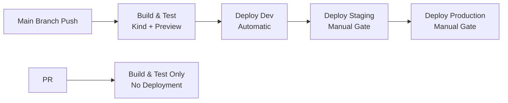

# Centralized Release Pipeline Scripts

This directory contains the **simplified** release pipeline implementation using GitHub Actions Environments and native GitOps patterns.

## Architecture Overview

The release pipeline uses a **GitHub Actions + GitOps** approach with native promotion gates:

- **Build & Test**: Uses existing `in-cluster-test.sh` for Kind + preview validation
- **Promotion Gates**: Uses GitHub Actions Environments with required reviewers
- **Deployment**: Direct Git commits to tenant repository (no PRs)
- **Governance**: Native GitHub UI for approvals and audit trail

## Active Scripts

### Core Scripts
- `build-and-push.sh` - Builds and pushes container artifacts with GitHub Output
- `deploy-direct.sh` - Direct GitOps deployment via Git commits (no PRs)

### GitHub Actions Workflows
- `.github/workflows/pipeline.yml` - Reusable workflow for all tenants
- `.github/workflows/example-tenant-workflow.yml` - Example tenant implementation

### Utility Libraries
- `lib/common.sh` - Common utility functions
- `lib/logging.sh` - Logging utilities
- `lib/config-discovery.sh` - Configuration discovery (simplified)

## Usage

### For Platform Operators

1. **Setup GitHub Environments** (one-time):
   - Go to tenant repository Settings > Environments
   - Create `staging` and `production` environments
   - Enable "Required Reviewers" for both
   - Assign approvers (QA Team, SRE, etc.)

2. **Deploy Reusable Workflow**:
   - The `pipeline.yml` is already available in this repository
   - Tenants reference it in their workflows

### For Tenant Services

1. **Copy Example Workflow**:
   ```bash
   cp zerotouch-platform/.github/workflows/example-tenant-workflow.yml <tenant-repo>/.github/workflows/release.yml
   ```

2. **Configure Secrets** (in tenant repository):
   - `BOT_GITHUB_TOKEN` - Token for tenant repository access
   - `AWS_ACCESS_KEY_ID` - AWS credentials for platform operations
   - `AWS_SECRET_ACCESS_KEY` - AWS credentials
   - `AWS_SESSION_TOKEN` - AWS session token (for OIDC)

3. **Workflow Behavior**:
   - **PR**: Runs build + test only (no deployment)
   - **Main Branch**: Full pipeline with automatic dev + manual staging/production gates

## Deployment Flow



## Benefits

- **90% Code Reduction**: From 2000+ lines to ~300 lines
- **Native Gates**: GitHub Environments > custom approval system
- **Better UX**: Web UI approvals instead of CLI scripts
- **Industry Standard**: Follows GitHub Actions best practices
- **Audit Trail**: Native GitHub audit logging
- **Simplified Maintenance**: Leverages platform features

## Archived Scripts

Old custom gate system moved to `archived/` directory:
- Custom promotion gates, history tracking, PR management
- Complex orchestration scripts replaced by GitHub Actions
- Helper modules replaced by simple direct deployment

## Migration Notes

Existing tenants should:
1. Update their workflows to use the new reusable workflow
2. Set up GitHub Environments for staging/production
3. Remove old custom gate configurations
4. Test the new approval flow

The new system maintains the same GitOps principles while leveraging GitHub's native features for better reliability and user experience.